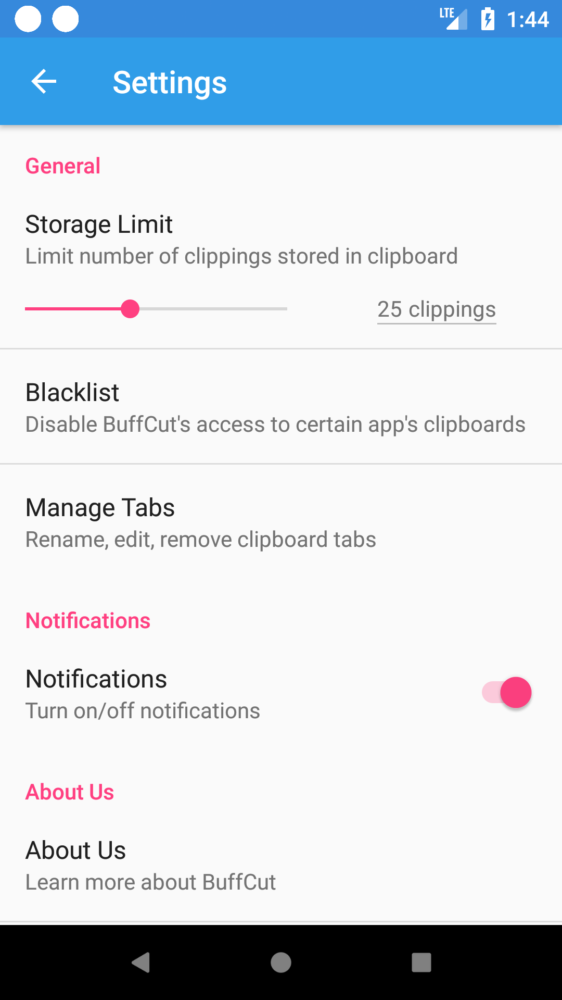
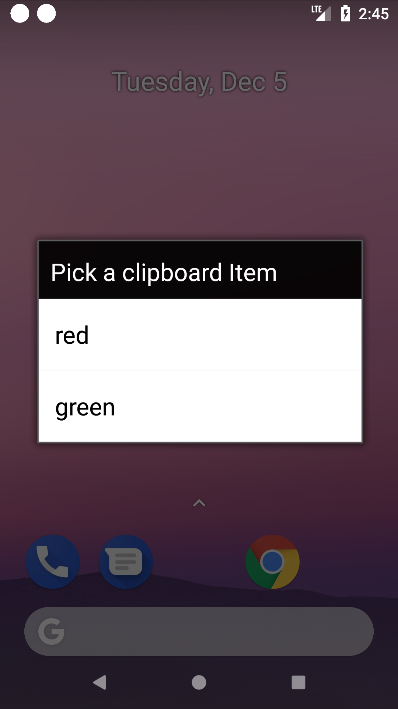

# BuffCut&trade; Help

## Table of contents

- [Welcome](#welcome)
- [Requirements](#requirements)
- [Install](#install)
- [Preferences](#preferences)
- [Copying](#copying)
- [Pasting](#pasting)
- [Uninstall](#uninstall)
- [Disclaimer](#disclaimer)

## Welcome

Welcome to BuffCut&trade;! The buggiest clipboard buffer this side of Texas. Hopefully you enjoy your experience. We don't want any of your feedback, so keep all your complaints to yourself. If you have questions, you have come to the right place, this will answer all of your questions! If you read this document in its entirety, and you still have questions, please refer to the [uninstall](#uninstall) guide.

As always, thank you for picking BuffCut&trade;.

Sincerely,

Team Monkey

## Requirements

- Android 4.2 or higher

## Install

To install this app you will need to act like a real developer because no one wanted to pay money to put this on the App Store.

1. Find a way to contact Team Monkey.
1. Ask Team Monkey for access to our BuffCut&trade; repository.
1. Clone the BuffCut&trade; repository to your local computer.
1. Install Android Studio.
1. Enable Developer mode on your phone.
1. Install BuffCut&trade; on your phone.

Now you are ready to use BuffCut&trade;!

## Preferences

The following is a pretty screenshot of our preferences page.

There are a couple of different things you can do here.

- Change the storage limit for the buffer. If only want to save the last 5 clips, you can do that! If you want to save the last 50, you can do that too! If you want to save the last 500, you can't, because no one should ever have that much power.

- You can click the blacklist button, but it doesn't do anything. Don't worry, it is supposed to do that. This is called scope creep kids, be scared of it.

- Basically the same with the rest of the buttons on this page. Even the about button, you would of thought that this was an easy thing to implement, but hey, when you don't have time, you don't have time.

## Copying

This is probably the coolest part of the app, from the moment you open it up to the moment you shut off your phone, all you have to do to add things to the buffer is copy the same way you have always known and loved. Just remember that if you restart your phone, you are going to have to launch the BuffCut&trade; app because our service doesn't start on startup.

## Pasting

In order to paste things you first have to click on the BuffCut&trade; notification, then you will see this!

Simply tap on the text and it will be copied to your clipboard so you can paste it!

There is a known bug where this overlay opens up the BuffCut&trade; app (which you then have to close in order to resume pasting), but hey, the good news is that this is easily fixed by you, the user. Because here at Team Monkey, we trust you enough to let you close an app that keeps opening when you don't want it to.

## Uninstall

You will probably use this feature the most out of any other features that we have implemented for you. The best part is, this is also the simplest part of the app. Simply follow the official Android guide for how to uninstall apps.

## Disclaimer

No cows were injured in the production of this app.

Please do not use this app for anything other than the prescribed uses. Offences include: planning to take over the world, actually using this app, and sending mass emails about your pets to your co-workers.

#

Property of Team Monkey (but if you really want it, you can have it)
